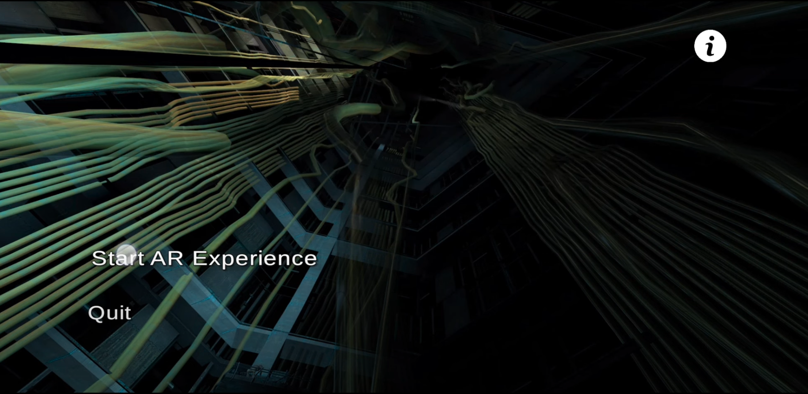

# elementARy: 
#### Developing AR Training Software for Laptop Repair

In 2019 during my internship at Dell Technologies, I led the development of elementARy, an innovative Augmented Reality (AR) training software designed for laptop repair. This article delves into the technical aspects of creating this solution, which allows users to interact with virtual laptop components through a unique pinch-to-zoom AR interface.

#### Technology Stack

- **Game Engine**: Unity
- **3D Modeling**: Blender
- **AR Framework**: ARCore (Android) / ARKit (iOS) [This is abstracted away by Unity]

### Development Process

#### 1. Conceptualization and Design

The initial phase involved mapping out the user experience and defining the core functionality:

- Pinch-to-zoom interaction for invoking the AR interface
- Realistic models of laptop components
- Step-by-step repair guidance through AR overlays
- Main menu before the AR screen is loaded

#### 2. 3D Asset Creation in Blender

We used Blender to create highly detailed 3D quads that held visual information about the layer of screen the user is currently looking at. We exported them and their materials to Unity's library.


#### 3. Unity Development

##### Setting up the Main Menu
Create a new AR application in Unity, with Vuforia integrated. I then utilized Unity's Scripting functionality to rig up the main screen of the application, with the following functionality:


```csharp
using System.Collections;
using System.Collections.Generic;
using UnityEngine;
using UnityEngine.SceneManagement;

public class MainMenu : MonoBehaviour
{
   public void PlayGame(){
       SceneManager.LoadScene(SceneManager.GetActiveScene().buildIndex + 1);
   }

   public void QuitGame(){

       Debug.Log("Exiting Application");
       Application.Quit();
   }
}
```
We then wire buttons on the initial scene (which we set up as a quad with interactive buttons as shown below), with the PlayGame() and QuitGame() functions.
We also prop the info button to show a modal screen with instructions, as shown below.

```csharp
using System.Collections;
using System.Collections.Generic;
using UnityEngine;

public class DialogManager : MonoBehaviour
{

    private Animator anim;
    //private bool flag = false;

    // Start is called before the first frame update
    void Start()
    {
        anim = GetComponent<Animator>();
    }

    // Update is called once per frame
    void Update()
    {
        anim.Play("hide_dialog");
    }
}}
```

##### Implementing Pinch-to-Zoom AR Interface

The core of our application revolves around the pinch-to-zoom functionality. We need to modify values in the below script and apply them to each quad that we want to manipulate. Plane1 and plane1_reverse are animations you need to create in the Unity environment, on the quads that we import from Blender.:

```csharp
using System.Collections;
using System.Collections.Generic;
using UnityEngine;

//Pinch out on the phone screen to start the animation for Plane 1
public class plane1_anims : MonoBehaviour
{

    private Animator anim;
    private bool flag = false;

    // Start is called before the first frame update
    void Start()
    {
        anim = GetComponent<Animator>();
    }

    void Update()
    {
        if ((PinchCheck()>0)&&(flag==true))
        {
            Debug.Log("Pinch In.\n");
            if (null != anim)
            {
                //Play Plane_1
                anim.Play("plane1_reverse 0");
                flag = false;
            }
            else
            {
                Debug.Log("Animation is Null");
            }
            
        }
        else if ((flag==false)&&(PinchCheck()<0))
        {
            Debug.Log("Pinch out.\n");
            //Debug.Log(PinchCheck());
            if (null != anim)
            {
                //Play Plane_1
                anim.Play("plane_1 0");
                flag = true;
            }
            else
            {
                Debug.Log("Animation is Null");
            }
        }
    }

    float PinchCheck()
    {
        if (Input.touchCount == 2)
        {
            Touch touchZero = Input.GetTouch(0);
            Touch touchOne = Input.GetTouch(1);

            Vector2 touchZeroPrevPos = touchZero.position - touchZero.deltaPosition;
            Vector2 touchOnePrevPos = touchOne.position - touchOne.deltaPosition;

            float prevTouchDeltaMag = (touchZeroPrevPos - touchOnePrevPos).magnitude;
            float touchDeltaMag = (touchZero.position - touchOne.position).magnitude;

            float deltaMagnitudeDiff = prevTouchDeltaMag - touchDeltaMag;

            return deltaMagnitudeDiff;
        }

            return 0;
    }
}
```


#### Challenges and Solutions

1. **AR Tracking Stability**: We implemented a custom tracking target to reduce jitter in AR object placement.
2. **Cross-Platform Compatibility**: Utilizing Unity's AR Foundation allowed us to maintain a single codebase for both iOS and Android.

#### Conclusion

Developing elementARy presented unique challenges in blending AR technology with practical training applications. By leveraging Unity's powerful features and custom optimizations, we created a robust, user-friendly AR training tool for laptop repair. This project showcases the potential of AR in technical education and sets a foundation for future advancements in this field.