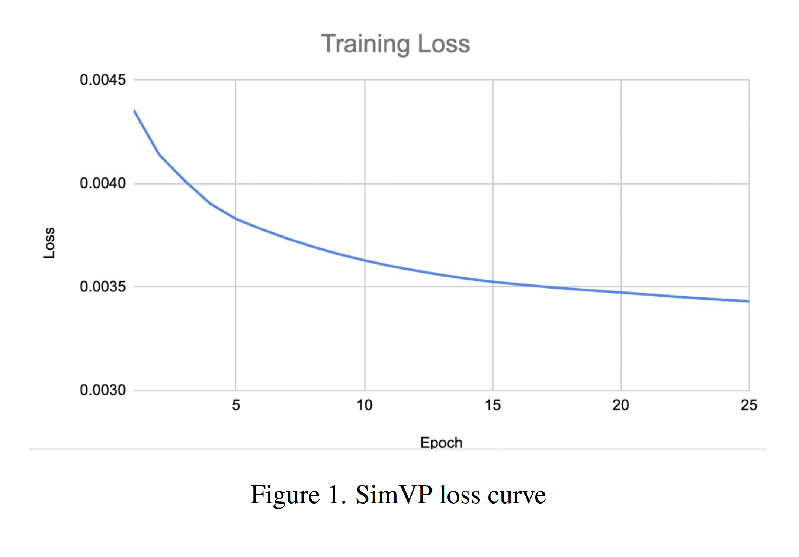
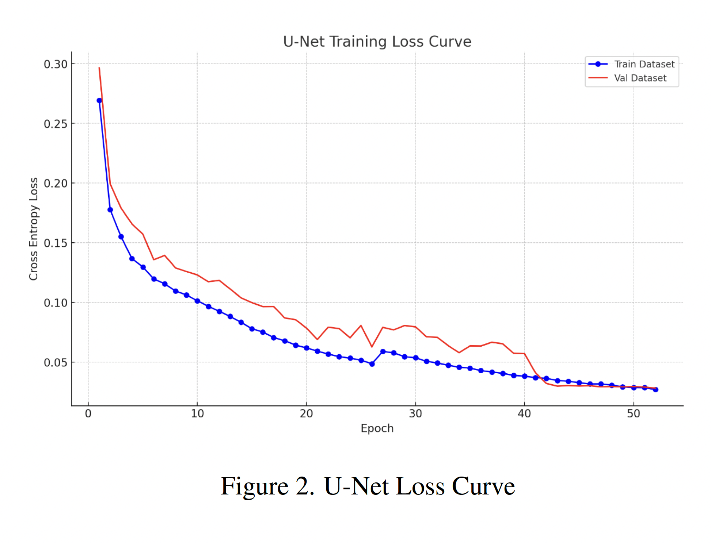
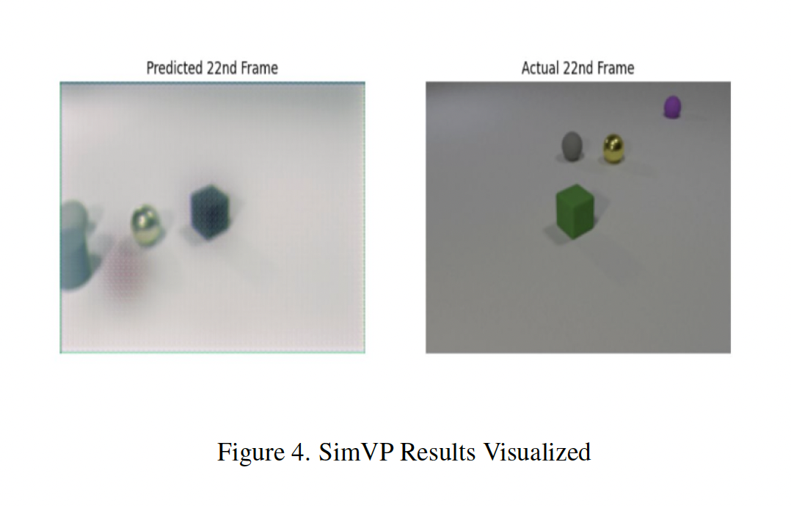
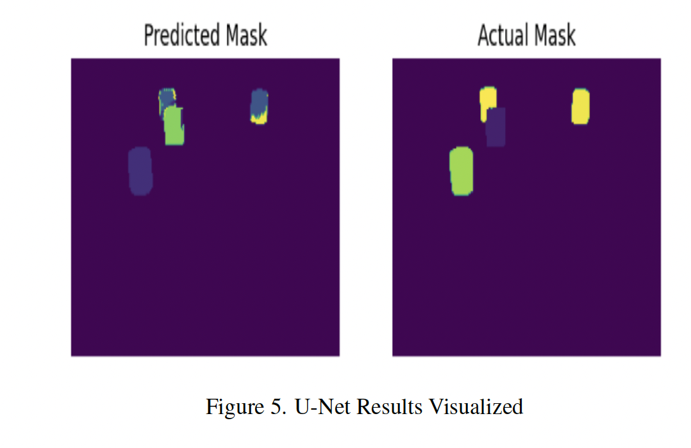

### Advancing Semantic Segmentation on Realistic Video with U-Net and SimVP

### Introduction

Semantic segmentation, the task of assigning a semantic label to each pixel in an image, has seen significant advancements in recent years. However, applying semantic segmentation to realistic video data presents unique challenges, such as temporal consistency and computational efficiency. In this article, we explore a novel approach to semantic segmentation on realistic video using two powerful models: U-Net and SimVP.

Our project focuses on predicting the semantic mask of the 22nd frame in a video sequence using only the first 11 frames. We leverage a combination of supervised and self-supervised learning techniques to tackle this problem. The dataset consists of synthetic videos depicting interactions between objects of various shapes, sizes, and materials, all adhering to physical laws.

<u><b>Note:</b> This project was undertaken with the Deep Learning course under Prof. Yann LeCun at New York University, Courant Institute of Mathematical Sciences.</u>

### Methodology

#### Frame Prediction with SimVP

The first step in our approach is frame prediction, where we aim to predict the 22nd frame based on the first 11 frames. For this task, we employ the SimVP model [1], which utilizes an Encoder-Translator-Decoder architecture with Inception blocks [2]. SimVP offers simplicity, state-of-the-art performance, and the ability to mitigate error accumulation, making it an ideal choice for our project.

The SimVP model is trained on both the labeled training set and the unlabeled dataset, comprising a total of 14,000 videos. We train the model for 25 epochs, as shown in the training loss curve below:

```python
# SimVP model training
model = SimVP(shape_in=shape_in).to(device)
model.train()

for epoch in range(epochs):
    for batch in train_loader:
        images, _ = batch
        input_frames = images[:, :11].to(device)
        target_frame = images[:, 21].to(device)
        
        predicted_frames = model(input_frames)
        predicted_target_frame = predicted_frames[:, -1]
        
        loss = frame_prediction_criterion(predicted_target_frame, target_frame)
        
        optimizer.zero_grad()
        loss.backward()
        optimizer.step()
```



#### Semantic Mask Segmentation with U-Net

For semantic mask segmentation, we leverage the U-Net architecture [3], renowned for its precision in similar tasks. The U-Net model is trained on the labeled training set for 50 epochs, using cross-entropy loss as the objective function.

```python
# U-Net model training
modelunet2 = UNet(n_channels, n_classes).to(device)
criterion = nn.CrossEntropyLoss()
optimizer = optim.Adam(modelunet2.parameters(), lr=0.001)

for epoch in range(num_epochs):
    modelunet2.train()
    running_loss = 0.0
    
    for images, masks in train_loader_image:
        inputs = images.permute(0, 2, 3, 1).to(device)
        masks = masks.to(device)
        
        optimizer.zero_grad()
        
        outputs = modelunet2(inputs)
        loss = criterion(outputs, masks)
        loss.backward()
        optimizer.step()
        
        running_loss += loss.item()
```



### Optimization Techniques

To optimize the training process, we employ the Adam optimizer for both models. Adam combines the benefits of AdaGrad and RMSProp, effectively handling sparse gradients and noisy problems common in deep learning tasks.

Additionally, for SimVP, we integrate learning rate schedulers like ReduceLROnPlateau to avoid getting stuck in local minima. This dynamic adjustment of the learning rate allows for finer tuning of model weights, increasing the likelihood of converging towards a global minimum and enhancing the overall performance and accuracy of the SimVP model.

### Results and Visualizations

#### Frame Prediction Results

The SimVP model demonstrates promising results in frame prediction, as shown in the visualization below. However, the model faces challenges in capturing object momentum, dealing with blurred captures, and accounting for new elements that may appear after the 11th frame.



#### Semantic Mask Segmentation Results

When applied to ground truth images, the U-Net model exhibits impressive accuracy, achieving an Intersection over Union (IoU) score of 0.91 on the validation set. However, when combining the SimVP and U-Net models, we observe a drop in performance, with an IoU score of 0.21 on the validation set. This can be attributed to the SimVP model's challenges in identifying new objects and generating blurry outputs.



| Model                           | IoU Score |
|---------------------------------|-----------|
| U-Net on Validation Set         | 0.91      |
| SimVP + U-Net on Validation Set | 0.21      |

### Potential Improvements

#### Extended Training Epochs

Increasing the training epochs for the SimVP model from 5 to 25, especially with unlabeled data, improved the Jaccard Coefficient of our linked model from 0.17 to 0.21. This suggests that extended training allows the model to more effectively learn dataset dynamics, enhancing frame prediction accuracy.

#### Alternatives to Self-Supervised Learning

Focusing on refining the U-Net model could be an alternative to self-supervised learning. A more accurate U-Net can generate better masks for unlabeled data, creating a stronger labeled set for SimVP training. This approach leverages U-Net's segmentation precision to improve SimVP input quality.

#### Integration of Autoregressive Architecture

Integrating an autoregressive architecture into SimVP [4] could capture sequential dependencies more effectively, potentially enhancing the model's temporal prediction accuracy. This modification aims to boost frame prediction reliability in complex video sequences.

### Conclusion

In this article, we presented our approach to semantic segmentation on realistic video using the U-Net and SimVP models. By leveraging frame prediction with SimVP and semantic mask segmentation with U-Net, we achieved promising results in predicting the semantic mask of the 22nd frame using only the first 11 frames.

Our experiments highlighted the importance of extended training epochs, the potential of alternatives to self-supervised learning, and the possibility of integrating autoregressive architectures to further improve performance.

As we continue to explore and refine our approach, we remain committed to pushing the boundaries of semantic segmentation on realistic video data, opening up new possibilities for applications in various domains.

