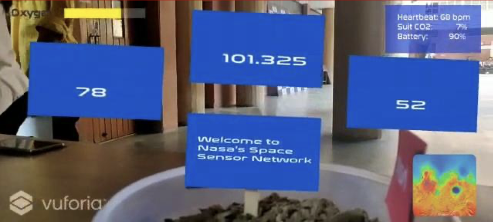

## AR HUD Application with Real-Time API Integration

At the 2019 NASA SpaceApps challenge, I led the development of an innovative Augmented Reality (AR) Heads-Up Display (HUD) application. This mobile solution overlays real-time information from various APIs onto the user's view of the world through their device's camera. Here's a deep dive into the technical aspects of creating this cutting-edge application.

#### Technology Stack

- **Development Platform**: Unity
- **AR Framework**: ARCore (Android) / ARKit (iOS) [Abstracted with Unity and Vuforia]
- **Networking**: RESTful API integration (Assuming TCP on mars :) )
- **UI Framework**: Custom shader-based UI for optimal AR performance

#### Key Features

1. Real-time API data fetching and display
2. AR object recognition and tracking
3. Dynamic UI elements that respond to real-world positioning
4. Low-latency updates for seamless user experience

### Development Process

#### 1. AR Foundation Setup

We utilized Unity's Vuforia Engine add-on to add AR Functionality to the app. We then create Quads to emanate from target images. The idea is for these images to be present near data/network locations, so you can get all your information and display it to the Astronaut.

Could there be any other image target we can think of?


#### 2. API Integration

We developed a flexible API manager to handle various data sources, for our astronaut on Mars. Question is, will Mars ever support TCP traffic? OF COURSE!

```csharp
using UnityEngine;
using UnityEngine.Networking;
using System.Collections;

public class APIManager : MonoBehaviour
{
    private const string API_BASE_URL = "https://api.host.com/";

    public IEnumerator FetchData(string endpoint, System.Action<string> callback)
    {
        using (UnityWebRequest webRequest = UnityWebRequest.Get(API_BASE_URL + endpoint))
        {
            yield return webRequest.SendWebRequest();

            if (webRequest.result == UnityWebRequest.Result.Success)
            {
                callback(webRequest.downloadHandler.text);
            }
            else
            {
                Debug.LogError("Error: " + webRequest.error);
            }
        }
    }
}
```

#### 3. HUD Component Development

We now create our HUD screen on the AR Scene set-up by Vuforia. We can link everything, including Remaining Oxygen, GPS Location with a minimap, and next objectives for the astronaut.


#### 4. Object Recognition and Tracking

I then implemented object recognition to anchor AR elements to the worm logo:

```csharp
using System.Collections;
using System.Collections.Generic;
using UnityEngine;

public class anim1 : MonoBehaviour

{
    private Animator anim;
    private MeshRenderer ms;
    private bool flag = false;
    

    // Start is called before the first frame update
    void Start()
    {
        anim = GetComponent<Animator>();
        ms = GetComponent<MeshRenderer>();
    }

    // Update is called once per frame
    void Update()
    {
        if ((PinchCheck() > 0) && (flag == true))
        {
            Debug.Log("Pinch In.\n");
            if (null != anim)
            {
                //Play Plane_1
                anim.Play("info1_reverse");
                flag = false;
            }
            else
            {
                Debug.Log("Animation is Null");
            }

        }
        else if ((flag == false) && (PinchCheck() < 0))
        {
            Debug.Log("Pinch out.\n");
            //Debug.Log(PinchCheck());
            if (null != anim)
            {
                //Play Plane_1
                anim.Play("info1");
                flag = true;
            }
            else
            {
                Debug.Log("Animation is Null");
            }
        }

    }

    float PinchCheck()
    {
        if (Input.touchCount == 2)
        {
            Touch touchZero = Input.GetTouch(0);
            Touch touchOne = Input.GetTouch(1);

            Vector2 touchZeroPrevPos = touchZero.position - touchZero.deltaPosition;
            Vector2 touchOnePrevPos = touchOne.position - touchOne.deltaPosition;

            float prevTouchDeltaMag = (touchZeroPrevPos - touchOnePrevPos).magnitude;
            float touchDeltaMag = (touchZero.position - touchOne.position).magnitude;

            float deltaMagnitudeDiff = prevTouchDeltaMag - touchDeltaMag;

            return deltaMagnitudeDiff;
        }

        return 0;
    }
}
```

#### 5. Performance Optimization

To ensure smooth performance, we implemented several optimization techniques:

- Use of object pooling for frequently updated UI elements
- High Contrast Image Target for Vuforia Compatibility

```csharp
public class HUDOptimizer : MonoBehaviour
{
    public int poolSize = 20;
    private List<GameObject> hudElementPool;

    void Start()
    {
        InitializeObjectPool();
    }

    void InitializeObjectPool()
    {
        hudElementPool = new List<GameObject>();
        for (int i = 0; i < poolSize; i++)
        {
            GameObject element = CreateHUDElement();
            element.SetActive(false);
            hudElementPool.Add(element);
        }
    }

    GameObject GetHUDElement()
    {
        foreach (var element in hudElementPool)
        {
            if (!element.activeInHierarchy)
            {
                element.SetActive(true);
                return element;
            }
        }
        
        // If no inactive elements, create a new one
        GameObject newElement = CreateHUDElement();
        hudElementPool.Add(newElement);
        return newElement;
    }

    GameObject CreateHUDElement()
    {
        // Logic to create a new HUD element
        return new GameObject("HUDElement");
    }
}
```

#### Challenges and Solutions

1. **Real-time Data Integration**: We implemented a pub-sub system to efficiently update UI elements as new data arrived from APIs.
2. **AR Tracking Stability**: Custom image anchors and sensor fusion techniques were used to improve tracking stability in various lighting conditions.
3. **Battery Optimization**: We developed an adaptive rendering system that adjusts the complexity of AR overlays based on the device's battery level and performance capabilities.

#### Conclusion

This AR HUD application pushes the boundaries of mobile AR technology, seamlessly blending real-time data with the user's environment. By leveraging cutting-edge AR frameworks and custom optimizations, we've created a responsive and intuitive interface that enhances the user's interaction with their surroundings. This project sets a new standard for information visualization and real-world data integration in augmented reality applications.